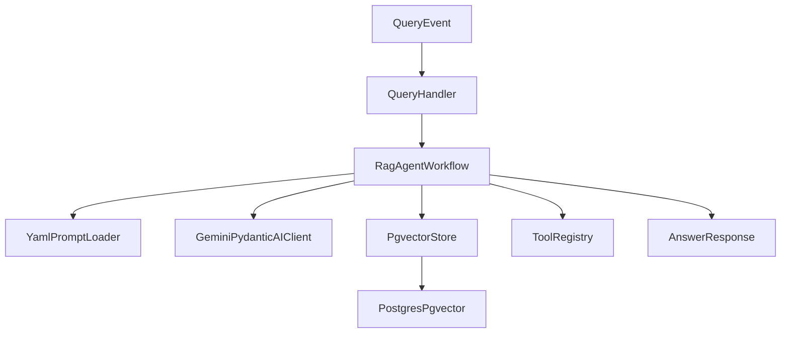

# Architecture

This template uses a staged, interface-driven workflow:

1. Load and render YAML prompts.
2. Plan retrieval.
3. Retrieve vector evidence from pgvector.
4. Optionally execute typed tools.
5. Synthesize final answer.
6. Optionally run critique and retry once.

## Key modules

- `src/config.py`: typed runtime settings.
- `src/interfaces.py`: contracts for model, retrieval, prompts, tools.
- `src/models.py`: Pydantic workflow and domain models.
- `src/workflows/rag_agent.py`: orchestrator state machine.
- `src/adapters/gemini.py`: Gemini-backed model and embeddings adapter.
- `src/adapters/pgvector_store.py`: asyncpg vector store implementation.
- `src/prompts/loader.py`: YAML prompt loader with variable rendering.
- `src/tools/registry.py`: typed tool registration and execution.

## Flow

## Reliability defaults

- Timeouts and retries on external calls.
- Typed inputs and outputs for tools.
- Deterministic prompt resolution with fallback errors.
- Explicit state transitions for debug-friendly execution.
- Baseline schema migration in `sql/001_init_pgvector.sql`.
